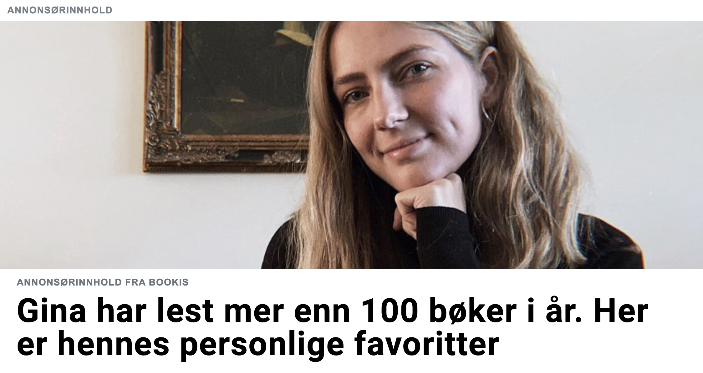

Ingen liker reklame. Reklame er ofte

1. *irrelevant* – du har ingen interesse av annonsørens produkt eller budskap
2. *plagsomt* – det tar bort plass og tid fra det du egentlig vil lese
3. *teit* – annonsørens retoriske tilnærming er ofte latterlig åpenbar, med uinspirerte forsøk på å skape humor og følelser 

For å selge produktene og ideene sine tjener det enhver annonsør å lage reklame som appellerer til forbrukeren. Det gjør sjelden reklame.

De tre reklametrekkene over viser nemlig mislykkede forsøk i [retorisk appellform](https://no.wikipedia.org/wiki/Aristoteles%27_retoriske_bevismidler) – på alle tre plan. Om reklamen er *irrelevant*, har logikk og fakta (logos) ingenting å si; er reklamen *plagsom* eller *uønsket*, har tilliten (etos) for lengst falt; er reklamen *teit*, er håpet om å skape sterke følelser og reaksjoner hos leseren (patos) fjernt.

## Løsningen er innholds&shy;markedsføring

«De journalistiske fortellerteknikkene [virker] mer salgsfremmende enn det tradisjonelt noe mer høylytte reklamespråket.» Det skriver Norsk Redaktørforening i veilederen sin kalt [«Slik skiller du journalistikk og reklame»](https://www.nored.no/NR-dokumentasjon/Rapporter-og-veiledere/Slik-skiller-du-journalistikk-og-reklame).

I *innholdsmarkedsføring* er reklamen ikledd *journalistikkens* form. Resultatet? Appellformene oppnår sitt fulle potensiale.

Bevis på dette fenomenet finner vi i en 2015-studie fra Høgskolen i Gjøvik. [«Inn­holds­markeds­føring testet på lesere av nettaviser»](https://ntnuopen.ntnu.no/ntnu-xmlui/handle/11250/2359010) forsket på fire nokså forskjellige individers holdning til, og atferd i møte med, inn­holds­markeds­føring (skjult reklame) kontra tradisjonell reklame. Studien gjorde flere viktige funn.

For det første mente leserne «at den kommersielle samarbeidspartneren kunne være relevant med hensyn til temaet». Testpersonene erkjente at en gitt reklame var relevant – noe som er høyst uvanlig med reklame.

Nøkkelordet her er *temaet*. De som allerede er interessert i temaet – de som leser innholdet, naturligvis – er mest sannsynlig interessert i reklamen. Slik kan annonsørene lage reklame leserene *har lyst til* å lese.

Innholdsmarkedsføring er altså en måte for annonsørene å sikte seg inn mot den rette målgruppa.

For det andre skriver forskerne at leserne sa at «reklamefiltrene» deres ikke ble trigget. Det betyr svært mye for annonsørene. Hvorfor? Fordi uten de såkalte reklamefiltrene har de retoriske appellformene mye større kjangs til å nå sitt fulle potensiale:

1. *Tilliten* er naturligvis langt høyere. Innholdet framstår som uavhengig istedenfor økonomisk motivert.
2. *Logisk overbevisning* virker bedre. Fakta som pris og ytelse er interessant for leseren når vedkommende er interessert i produktet.
3. Sjansen til å vekke *følelser og reaksjoner* hos leseren er langt høyere. Berømt journalist [Svein Brurås](https://www.hivolda.no/tilsette/institutt-journalistikk/svein-harald-bruras) skriver at produsenter av tekstreklame ofte er tidligere journalister som vet hvordan man tar i bruk journalistiske virkemidler som intervju- og reportasjeteknikker og personifiserte vinklinger ([*Etikk for journalister* (6. utg.)](https://www.fagbokforlaget.no/Etikk-for-journalister,-6.-utgave/I9788245034325), s.&nbsp;96).

Inn­holds­markeds­føring er altså et resultat av leseratferd – et resultat av at vi hater tradisjonell reklame. Det er en måte for annonsører å kombinere den journalistiske læren og den retoriske læren, som til sjuende og sist skaper reklame som appellerer til leseren.

## Så, hvem taper?

Journalistene. Skjult reklame er et angrep på den journalistiske *integriteten*, som igjen er et angrep på den journalistiske *troverdigheten*.

Integritet handler om å være uavhengig – å ha egne meninger som ikke er påvirket av andres. En streben etter «journalistisk integritet» er altså en streben etter at journalister skal være uavhengige.

Problemet med inn­holds­markeds­føring er at innholdet ikke er uavhengig. Likevel *ser* det uavhengig ut. Det er falskt innhold.

Om en leser finner ut at en redaksjon har talt bak betaling uten å opplyse ham, forsvinner redaksjonen og journalistens troverdighet raskt. Og *det* er et problem. Tidligere generalsekretær i Norsk Presseforbund, Per Edgar Kokkvold, har sagt: «Vår integritet er ikke bare vårt mest kostbare, men også vårt mest sårbare aktivum. Det er det vi lever av i det lange løp» (*Etikk for journalister* (6. utg.), s.&nbsp;89).

Hvorfor er journalistens integritet et «aktivum»? Fordi det lar ham/henne fortelle sannheten – alltid – da han/hun ikke trenger å ta noens side. To eksempler:

1. [Vær Varsom-plakaten](https://presse.no/pfu/etiske-regler/vaer-varsom-plakaten/) sier at «pressen har et spesielt ansvar for at ulike syn kommer til uttrykk». Dette ansvaret blir umulig å oppfylle om journalisten ikke er fri og uavhengig. Hvordan kan journalisten fortelle om den nye teknologien i iPhone&nbsp;12, om han/hun er kjøpt og betalt av Samsung?
2. Plakaten sier også at «pressen har rett til å informere om det som skjer i samfunnet og avdekke kritikkverdige forhold». Denne retten er helt frastjålet om journalisten er kjøpt og betalt. Hvordan kan journalisten fortelle om Samsungs ressursmisbruk i Afrika, om han/hun er kjøpt og betalt av det samme selskapet?

## Mulige løsninger

Integritetsproblemet oppstår naturligvis bare om det ikke er tydelig for leseren at innholdet er reklame og ikke journalistikk. Dessverre hevder forskerne i Gjøvik-studien at «reklame som kan se ut som journalistikk, blir forvekslet med journalistikk».

For å verne den journalistiske integriteten må produsentene derfor gjøre det tydelig hva slags innhold det er snakk om.

Men hvem er egentlig disse produsentene? Redaksjonene selv – nesten. For å slippe de negative sanksjonene som hadde møtt dem om de *selv* hadde produsert og publisert (skjult) reklame, har mange mediebedrifter opprettet egne avdelinger for produksjon av inn­holds­markeds­føring. Aftenposten og VG er eksempler på dette fenomenet, med henholdsvis [«Brand Studio»](https://www.facebook.com/AftenpostenBrandStudio/) og [«Partnerstudio»](https://www.vg.no/annonsorinnhold/native/?skey=8384d1cc&preview=true).

Søket etter et slikt skille stammer fra den tradisjonelle holdningen at *redaksjonen og sponsorbilaget skal være adskilte.* Vær Varsom-plakaten sier: «Unngå dobbeltroller, verv, oppdrag eller bindinger som kan skape interessekonflikter eller føre til spekulasjoner om inhabilitet».

Dette kravet står fortsatt sterkt i dag. Hvorfor? Fordi det rører «selve grunnfjellet i journalistikkens troverdighet; at du kan stole på at det du leser, hører eller ser ikke er et resultat av at noen har kjøpt seg plass for på en eller annen måte å fremme sine egne meninger», ifølge Norsk Redaktørforening (i «Slik skiller du journalistikk og reklame»).

Likevel sier foreningen at den «hele tiden [har] understreket at det nettopp er en *veileder* [den] skal utgi», ikke «regler» eller «retningslinjer», da den mener slikt «vil bryte med det som er det første målet til foreningen: å jobbe for at enhver enkelt redaktør skal ha størst mulig handlingsrom til å foreta frie publistiske valg».

Er det den rette holdningen? Vi må ikke glemme at troverdigheten til én journalist faktisk påvirker troverdigheten til alle journalister. Om en leser finner ut at én journalist ikke har vært uavhengig, vil vedkommende høyst sannsynlig miste troa på journalister generelt.

At én redaksjon har åpent for dobbeltroller, er et angrep på alle journalister. Det bør være en nulltoleranse.

## Det visuelle skillet

Dette er en interessant løsning. Løsningen går ut på å skille reklame fra journalistikk gjennom visuelle kontraster. Det visuelle skillet har potensiale, men må videreutvikles.

Problemet med visuelle hint er at de ofte ikke er så tydelige. Se på denne tekstreklamen fra Aftenposten:

<figure className="medium">
  
  <figcaption>Annonse som leder til <a href="https://www.aftenposten.no/brandstudio/feature/v/bookis/derfor-bruker-de-bookis/">«Aftenposten Brand Studio»</a>.</figcaption>
</figure>

Her er det ikke en stor nok kontrast til å skille reklamen fra vanlige Aftenposten-artikler – selv om det står «annonsørinnhold» både over og under bildet, og selv om tittelen bruker en [grotesk skrifttype](https://no.wikipedia.org/wiki/Grotesk_(skrift)) istedenfor Aftenpostens standard [antikva skrifttype](https://no.wikipedia.org/wiki/Seriff). For når du blar deg gjennom avisen, er det ikke en liten endring i font du legger merke til. Det er heller ikke de små «annonsørinnhold»-merkelappene. Du legger merke til den store teksten og det store bildet.

Så hva mangler denne annonsen for å skille seg ut visuelt? Farger! [Fargekontraster fanger oppmerksomheten](https://practicaltypography.com/color.html) bedre enn noen andre visuelle egenskaper på papir og skjerm. Farger har også en veletablert «reklamekonnotasjon» hos mange folk. Se side 12 av Gjøvik-studien – ett av individene der sa: «[D]et første som slår meg, […] er liksom hovedbildet, det største bildet. Og så kanskje reklamen. Mye på grunn av fargene. De røde fargene.»

For øvrig hevder studien at «det brukes mange ulike merker for å vise at noe er kommersielt innhold. I sum blir dette uoversiktlig og utydelig for leserne».

En standard for hvordan tekstreklame skal se ut og merkes hadde løst disse to problemene. En standard hadde gjort leseren godt kjent med hvordan tekstreklame ser ut – med en fargekontrast vedkommende faktisk legger merke til. I tillegg hadde den redusert forvirringen som oppstår når redaksjoner bruker tvetydige ord som «samarbeid» og «partner», da slike ordmerker «ikke uten videre oppfattes som reklame» hos mange lesere, ifølge Gjøvik-studien.

## Konklusjon

Inn&shy;holds&shy;markeds&shy;føring eksisterer på grunn av – ikke til tross for – leseratferd. Derfor kan vi ikke se på det som noe fullstendig negativt; noe vi må «eliminere».

Likevel vet vi at det er farlig når reklame og journalistikk blir ett. Det svekker den journalistiske integriteten, som til sjuende og sist hindrer journalisten fra å oppfylle arbeidsoppgaven sin.

Men hva kan vi gjøre? En god start er å innføre en nulltoleranse mot å ha «journalist» og «markedskonsulent» i samme stilling – for en slik blanding svekker troverdigheten til alle journalister.

Et mindre drastisk tiltak er å etablere en standard for det visuelle skillet vi ser mange redaksjoner allerede bruker. På den måten unngår vi leserforvirringen vi ser i Gjøvik-studien.