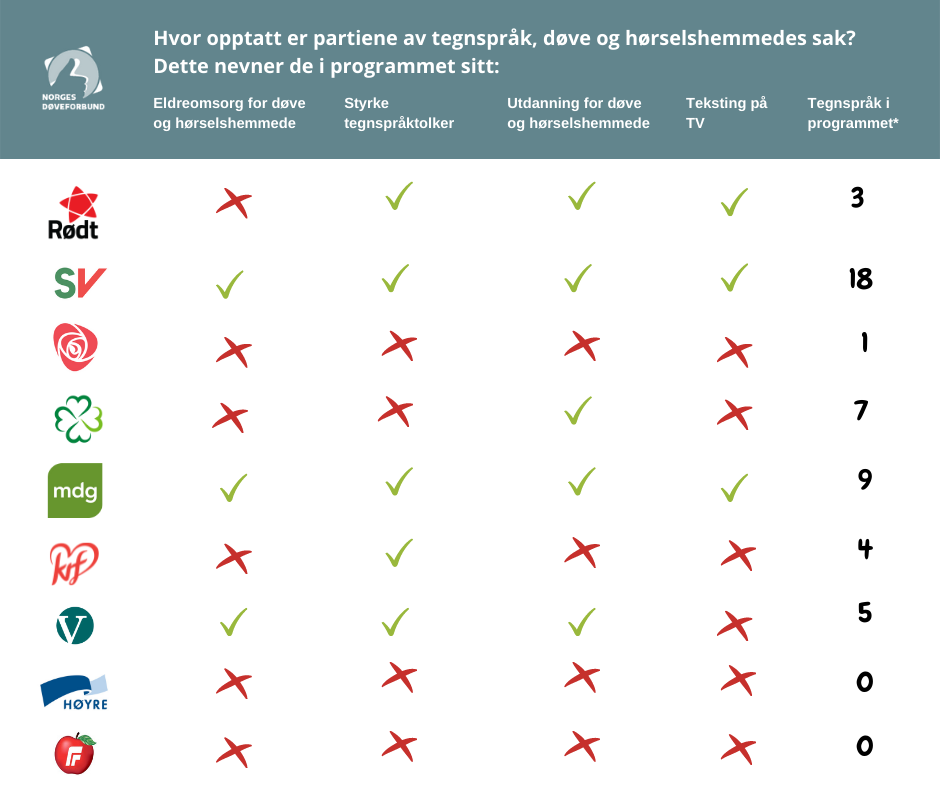

<!-- <Figure 
  source="IMG_3777.jpeg"
  size="xlarge" 
  caption="I SV-huset på Nytorget i Stavanger sentrum førebur Paal Kloster seg til debatt hos Stavanger døveforening." 
  photographer="Magnus R. Kolstad">
</Figure> -->

<figure className="xlarge">
  
  <figcaption>I SV-huset på Nytorget i Stavanger sentrum førebur Paal Kloster seg til debatt hos Stavanger døveforening. Magnus R. Kolstad</figcaption>
</figure>

– Dette skal gå så greitt, så greitt.

Sola skin på blåkvit himmel ein torsdagskveld i september. Paal Kloster står framfor dei Døves Hus i Saudagata sentralt i Stavanger. Huset, som fyller åttifem i år, er kritkvit i farga og boksete i forma.

Paal skal straks debattera døverettar og døvetilbod hos Stavanger døveforening.

Han er ikkje stressa. Han debatterte i dei Døves Hus to år tilbake. Og så er han sikker på sitt eige parti – dei fikk jo fire av fire grøne hakar frå Norges Døveforbund i førespelet av denne debatten.

  <label>Fakta</label>
  <h2>Paal Kloster (58)</h2>
  <ul>
    <li>By- og samfunnsutvikling i Stavanger. Tidlegare leiar i Stavanger SV.</li>
    <li>Ikkje gift, tre søner.</li>
    <li>Utdanna sivilarkitekt på Noregs tekniske høgskole (nå NTNU).</li>
    <li>Stiller til val som 2. stortingskandidat for Sosialistisk Venstreparti i Rogaland.</li>
  </ul>

Paal låser sykkelen sin og går inn. Det luktar sjukehus på veg opp trappa.

– Hei!

Han helsar på to av politikarane han skal debattere – Frp-aren og KrF-aren. Dei vekslar nokon ord før ei middelaldrande dame orsakar seg fram. Ho tek plass på talarstolen oppe i venstre hjørne.

## Den stille debatten

– Ja, alle saman, då byrjar me.

Stemma kjem ikkje frå venstre hjørne. Ho kjem frå midten av salen. Der, mellom publikum og bogen av politikarar, sit ei jente og ein gut. Dei er begge i 20-åra. Dei har kvart sitt kort festa på kleda, kor det står «NAV».

– Då er me klare til kveldens debatt her i dei Døves Hus.

Det er jenta som snakkar. Ho har ryggen vend mot publikum og blikket festa på dama i hjørnet. Ho ønsker publikum velkome.

Debatten byrjar. Frode Myrhol frå Folkeaksjonen nei til meir bompengar er fyrst ut. Han, som alle dei andre politikarane, skal halda eit ti minutts innlegg kor han svarar på fem spørsmål frå foreininga.

Guten med Nav-kortet reiser seg, og Myrhol byrjar å tala. Guten vender seg mot publikum og startar å vifta med armane. I dei neste ti minutta er han brua mellom Myrhol og publikum.

<figure className="xlarge">
  
  <figcaption>Frode Myrhol (FNB) talar gjennom tolkaren Mathias Brattaule. Jenta har blikket festa på Mathias gjennom heile talen. Magnus R. Kolstad</figcaption>
</figure>

Så er det Raudts tur, etterfylgt av Arbeidarpartiet og Senterpartiet. Ti minutts innlegg på norsk rogalandsk og norsk teiknespråk. Eitt og eitt parti, ti og ti minutt om gongen. Jenta og guten frå Nav byter på annankvar gong.

Endeleg er det Sosialistisk Venstrepartis tur. Paal kremtar; klargjer stemma for dei som har nytte av *det*. Han byrjar å fortelja om ein av sønene sine, som gjekk i barnehagen saman med døve barn.

Så snakkar han politikk.

– Personar med funksjons&shy;ned&shy;settingar skal me jobbe for så mykje me kan, så dei blir inkluderte i samfunnet på lik linje med alle andre, seier Paal til salen.

Han viser fram lappen Norges Døveforbund sjølv har laga. Fire av fire grøne hakar til Sosialistisk Venstreparti. 

<figure className="xlarge">
  
  <figcaption>Paal viser fram lappen Norges Døveforbund hadde laga i førespelet av debatten. Magnus R. Kolstad</figcaption>
</figure>

<figure className="small">
  
  <figcaption>Fire av fire grøne hakar til Paals parti. <a href="https://www.doveforbundet.no/nyheter/2021/08/25/oversikt-over-partiprogram-som-stotter-dove-horselshemmede-og-tegnsprak">Norges Døveforbund</a> </figcaption>
</figure>

Han legg ikkje skjul på at det ligg både glede og stoltheit i at partiet hans toppar lista på rettar for dei døve.

## Å sjå og forstå

For Paal er nemleg kampen for dei undertrykte i samfunnet meir enn politikk. Han er ein verdi. Eit livssyn.

– Mor mi fortel at heilt ifrå eg var bitte liten, har eg vore ein person som har brydd seg om andre veldig mykje. Og så har eg jo levd ei stund. Eg kan tenke meg at eg var mykje meir egoistisk og sjølvopptatt enn eg er no. 

– *Kva skjedde?*

Han stoppar opp og tenker litt.

– Eg trur det handlar om ei samfunnsforståing som er komen med åra. Eg forstår komplekse samanhengar og korleis folk tenker. Det kan eg nok takka militæret for.

– *Å?*

– I militæret blei me kasta ut i felten saman med alle slags typar folk; fiskarsøner, professorsøner og så vidare. Eg dømde folk då, men nå spør eg meg sjølv korleis i alle dagar eg kunne tenka slik om ein annan i grøn uniform. Etter kvart lærte eg å sjå korleis dei tenkte ut ifrå nokon føresetnadar i liva deira.

– *Er den evna ei politisk tilhøyrsle, eller er ho berre ein personleg eigenskap ved deg?*

– Eg trur nok at det er ei overvekt av folk i parti som SV som har den evna, ja. Men eg skal ikkje skulde andre parti for å vera egoistiske av den grunn.

## Lyttar til dei døve

Medan publikum stormar ned i salen for å forsyna seg av kaffi og vaflar, kjem ei eldre kvinne opp til plassen kor Paal sit. Ho har med seg jenta med Nav-kortet. Kvinna har eit grått apparat festa bak venstre øyra.

Ho ser på Paal og byrjar å vifta med armane. Paal ser tilbake på henne medan han lyttar til jenta.

– Neste år blir eg sytti år, seier jenta. –&nbsp;Og eg har venta og venta sidan 2004 på sjukeheim for døve. Eg veit ikkje korleis framtida mi blir – om eg blir dement eller om eg kjem på aldersheim. Eg synest det må settast i gong eit betre sjukeheimstilbod her i Stavanger.

Paal nikkar.

– For nå har eg venta og venta!

Kvinna forsøker å laga lyd, men Paal hadde ikkje forstått henne om det ikkje hadde vore for jenta ved sida av.

<figure className="xlarge">
  
  <figcaption>Aud Kristin Røstad (69) ønsker sjukeheim for døve i Stavanger. Ho talar gjennom tolkaren Marte Torstensen. Magnus R. Kolstad</figcaption>
</figure>

Det er tydeleg at historia hennar pregar han. Dette er jo korfor Paal driv med politikk; for å tala på vegne av dei med lågast stemme.

Jobben hans inneber faktisk mellom anna å skapa ein by som legg til rette for og inkluderer dei med nedsett funksjons&shy;evne. Han er utdanna sivil&shy;arkitekt, med ei spesialisering innanfor byplanlegging. Han har skrive fleire [innlegg](https://www.paqle.no/p/paal-kloster/2018766) om det han kallar «sosial utbygging».

Han fortel kvinna at han skal ta bodskapen med vidare.

## Kampen om Stortinget

Som andrekandidat skal det enda godt gjerast at Paal kjem på Stortinget.

– då skal me i alle fall gjera eit skikkeleg godt val, seier Paal bestemt.

Men han er klar til å flytta til Oslo viss det skulle skje. Minstemann starta jo nettopp på folkehøgskole. Og så hadde nok dama funne seg ein ny lærarjobb i Oslo slik at ho òg kunne ha blitt med.

Nei, Paal brukar heller ettermiddagane på å kjempa for Ingrid Fiskaa – Rogaland SVs førstekandidat.

Dagen etter debatten møtest Ingrid og Paal hjå Tannhelse Rogaland nærme Stavanger museum. Der møter dei Audun Lysbakken. Partileiaren gjestar Stavanger i samband med valkampen.

– Paal er ein «all-rounder» med god greie på bustadspolitikk. Han er kunnskapsrik og roleg, og så har han veldig god peiling på Stavanger. Eg brukar han til det meste, seier Ingrid og ler. 

<figure className="xlarge">
  
  <figcaption>Ingrid Fiskaa og Paal Kloster møtest hjå Tannhelse Rogaland i samband med valkampen. Magnus R. Kolstad</figcaption>
</figure>

Saman kjempar dei ein kamp om stortingsplass for Ingrid.

## Erfaren sosialist

«Om ein ikkje er ein sosialist i ein alder av tjue, manglar ein hjarta, men om ein framleis er ein sosialist over tretti, manglar ein hovud.»

Slik lydar [eit gamalt ordtøke](https://quoteinvestigator.com/2014/02/24/heart-head/).

– Det må jo ha blitt sagt av nokon som mangla hovud sjølv, seier Paal og ler.

Politikaren trur ikkje ordtøket har noko for seg. For han har utviklinga vore motsett.

– Om materiell verdi er det viktigaste for deg, kan det nok stemme. Eg trur det er meir vanleg å tenka slik når du er 18. Men om du tenker slik når du er 60, då har du rett og slett ikkje følgt med.

<figure className="xlarge">
  
  <figcaption>Å sjå og forstå. Her lyttar Paal til Røstad, som ønsker sjukeheim for dei døve i Stavanger. Magnus R. Kolstad</figcaption>
</figure>

58 år på jorda har lært Paal å forstå folk og komplekse samanhengar. 

58 år på jorda har gitt Paal ein trong til å stå opp for dei undertrykte.

58 år på jorda har gjort Paal til ein erfaren sosialist.